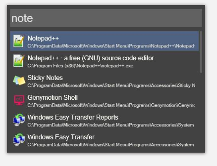

## 装机常用的软件清单 awesome software list

#### 两大原则:
1. 能不装就不装
2. 已开源软件为主，绝对不装流氓行为的软件

### 电脑技巧
```
不要使用admin账户登录，使用自己的账户只是赋予能够获取admin权限，这样每次有软件想获取admin权限更改电脑都会有提醒

win + G 录屏

```
   
### List

1. flux: 护眼, 根据本地时间调节屏幕亮度和蓝光 
  [flux](flux/)

2. 7z: 开源无广告解压缩
   https://www.7-zip.org/

3. everything: 利用索引，快速查询文件
 
4. Wox: An effective launcher for windows  http://www.wox.one/
    ```
   不再需要桌面图标，可以快捷启动，查找任何软件
   可添加插件:
   配合everything快速查找任何文件
   还有快捷计算器，快速google查询, 启动CMD等等
   ```
   

5. geek Uninstaller: 软件卸载清理，连带注册表, 还有系统自带的软件
6. Xshell: ssh客户端，永久激活版
7. windirstat: 磁盘整理工具，分析文件分布，找到大文件
8. driver booster: 驱动安装，没有其他多余功能
9. 迅雷极速版: 无广告下载,也可用 --> aria2
10. ssr: 科学
11. advanced systemcare 12 pro: [破解版](./advanced_systemcare) 系统清理保护
12. uupoop: 在线PS https://www.uupoop.com/
13. MPC-HC: 超轻量视频播放器 https://mpc-hc.org/downloads/
14. window termimal: window 终端 
    ```
    PowerShell 配置： https://github.com/spencerwooo/dotfiles#windows 
    oh-my-posh：https://github.com/JanDeDobbeleer/oh-my-posh#installation
    ```
15. scoop: window package manager 包管理器 
    ```
    https://scoop.sh/
    安装 install scoop: iwr -useb get.scoop.sh | iex

    scoop 使用:
    (https://github.com/lukesampson/scoop/blob/master/buckets.json)
    查看可添加仓库: scoop bucket known
    查看已添加仓库: scoop buckek list

    添加仓库:
    scoop bucket add extras
    scoop bucket add java
    scoop bucket add jetbrains

    搜索软件 nodejs: scoop search nodejs
    安装 scoop install nodejs
    卸载 scoop uninstall nodejs
    升级 scoop udpate nodejs
    查看状态 scoop status
    查看软件官网 scoop home aria2

    scoop升级了软件之后,旧版本仍会保留在电脑上,以便于切换到旧版本,想要删除软件旧版本: scoop clean nodejs

    清理缓存的安装包 scoop cache rm nodejs

    scoop 优点：
    scoop 软件安装目录统一 C:\Users\用户名\scoop\apps
    scoop 安装的软件自动设置环境变量
    scoop 通过shim来软链接应用

    ```
16. chrome 插件系列
    ```
    * 油猴 Tamper monkey: 脚本插件
    * Listen1: 在线音乐播放器，集成了网易，虾米, QQ三家资源
    * OneTab: 快速关闭网页，清理浏览器内存，也可快速恢复网页
    * Awesome Screenshot Minus: 网页截长图
    * google doc: 离线文档，支持office格式
    * Infinity: 浏览器新页面导航
    * Postman: 发送restful请求
    * 划词翻译 6.4.5
    * 快捷扩展管理: 一键管理所有扩展，快速激活、禁用插件。
    * Adblock Plus - 免费的广告拦截器
    * last pass: 密码管理
    * IDM: 多线程下载
    * Web Server for Chrome: 快速启动一个web server
    * SourceGraph: on github 文件树浏览和 Github Jump to definition 的定义跳转功能
    * GitZip 插件：下载仓库中部分代码

    ```
